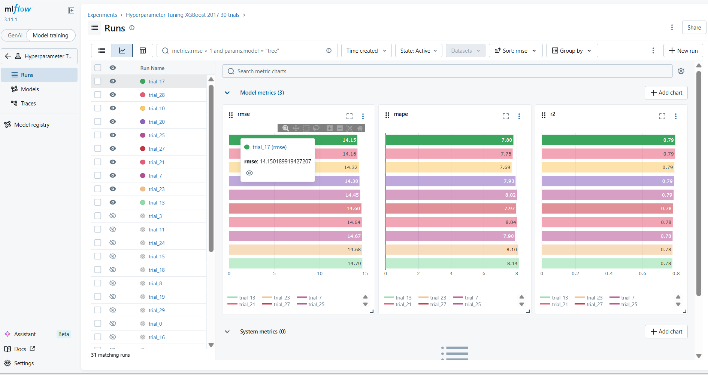

# 🛒 Weekly Sales Forecasting with XGBoost

A production-ready time-series forecasting pipeline that predicts **weekly store sales** using **XGBoost**, **Optuna** for automated hyperparameter tuning, **MLflow** for experiment tracking and model management, and **FastAPI** to serve predictions through a REST API.

---

## 📁 Project Structure

```
forecast_xgboost/
├── data/
│   └── raw/
│       └── train.csv          # Raw sales dataset (Kaggle Store-Item Demand)
├── mlruns/                    # MLflow experiment tracking (auto-generated, git-ignored)
├── mlflow.db                  # MLflow SQLite backend (auto-generated, git-ignored)
├── process_df.py              # Feature engineering & data splitting utilities
├── train_xgboost.py           # Training pipeline: Optuna tuning + MLflow logging
├── app.py                     # FastAPI inference service
├── .gitignore
└── README.md
```

---

## 🧠 How It Works — Step by Step

### 1. Data Preparation (`process_df.py`)

The raw dataset contains daily sales for multiple stores and items. The pipeline:

1. **Groups** the records by `store` and `item` to retain the full scope of the dataset.
2. **Resamples** daily data to **weekly frequency** per store and item (sum of sales per week).
3. **Creates calendar features**: `year`, `weekofyear`, `month`, `quarter`.
4. **Creates a lag feature**: `sales_lag_52` — sales from exactly 52 weeks ago (same week, previous year) calculated independently per store and item.
5. **Drops NaN rows** introduced by the lag.
6. **Sorts by date** and **splits** the dataset into train and test sets by date.

**Final feature set used for training:**

| Feature | Description |
|---|---|
| `store` | Unique identifier for the store |
| `item` | Unique identifier for the item |
| `year` | Calendar year |
| `weekofyear` | ISO week number (1–52) |
| `month` | Month of year (1–12) |
| `quarter` | Quarter of year (1–4) |
| `sales_lag_52` | Sales from the same week one year ago (per store & item) |

---

### 2. Hyperparameter Tuning with Optuna (`train_xgboost.py`)

[Optuna](https://optuna.org/) is a framework-agnostic hyperparameter optimization library. It uses **Tree-structured Parzen Estimators (TPE)** to efficiently search the parameter space, focusing trials on promising regions rather than sampling randomly.

#### Tuned Parameters

| Parameter | Range | Scale |
|---|---|---|
| `n_estimators` | 50 – 300 | linear |
| `max_depth` | 2 – 8 | linear |
| `learning_rate` | 0.01 – 0.3 | log |
| `subsample` | 0.5 – 1.0 | linear |
| `colsample_bytree` | 0.5 – 1.0 | linear |
| `reg_alpha` | 1e-4 – 10.0 | log |
| `reg_lambda` | 1e-4 – 10.0 | log |

#### Objective Function

Each Optuna **trial**:
1. Samples a set of hyperparameters.
2. Trains an `XGBRegressor` on the training split.
3. Evaluates on the test split using **RMSE** (the minimization target), **MAPE**, and **R²**.
4. Logs all metrics and the trained model to MLflow as a **child run**.

Optuna runs **30 trials** and selects the combination with the lowest RMSE.

---

### 3. Experiment Tracking with MLflow (`train_xgboost.py`)

[MLflow](https://mlflow.org/) tracks every experiment run, its parameters, metrics, and artifacts.

#### Run Hierarchy

```
Parent Run: optuna_xgboost_regression
├── Tags: model, optimizer, task, dataset, store, item
├── Params: train/test date ranges, best trial params
├── Metrics: best_rmse
│
├── Child Run: trial_0  ← logged inside each Optuna trial
│   ├── Params: n_estimators, max_depth, learning_rate, ...
│   ├── Metrics: rmse, mape, r2
│   └── Artifacts: model/  ← full XGBoost model saved here
│
├── Child Run: trial_1
│   └── ...
│
└── Child Run: trial_29
    └── ...
```

#### Key MLflow Patterns Used

- **`mlflow.set_experiment()`** — isolates runs under a named experiment.
- **`mlflow.start_run(nested=True)`** — creates child runs inside the parent Optuna loop.
- **`mlflow.log_params()`** — records all hyperparameters for every trial.
- **`mlflow.log_metrics()`** — records RMSE, MAPE, and R² for each trial.
- **`mlflow.xgboost.log_model()`** — saves the XGBoost model as an MLflow artifact with a standardized schema.
- **`trial.set_user_attr("run_id", ...)`** — stores the MLflow run ID on the Optuna trial so the best model can be retrieved by its run ID.

#### Retrieving the Best Model

After training, the best child run ID is logged as a parameter (`best_child_run_id`) on the parent run. The API (`app.py`) loads the model directly using this run ID. You can easily find the best run visually in the MLflow UI:



```python
# Replace with your actual run ID from MLflow
RUN_ID = "<YOUR_BEST_RUN_ID>"
model = mlflow.xgboost.load_model(f"runs:/{RUN_ID}/model")
```

---

### 4. Inference API (`app.py`)

A [FastAPI](https://fastapi.tiangolo.com/) service exposes the best trained model for real-time predictions.

#### Endpoints

| Method | Path | Description |
|---|---|---|
| `GET` | `/` | Health check |
| `POST` | `/predict/single` | Predict sales for a given week |

#### Example Request

```bash
curl -X POST http://localhost:8000/predict/single \
  -H "Content-Type: application/json" \
  -d '{"store": 1, "item": 1, "date": "2017-06-05", "lag_52": 420.0}'
```

#### Example Response

```json
{
  "week_start": "2017-06-05",
  "predicted_sales": 478.35
}
```

---

## 🚀 Getting Started

### Prerequisites

- Python 3.10+
- pip

### Installation

```bash
# Clone the repository
git clone https://github.com/your-username/forecast-xgboost.git
cd forecast-xgboost

# Create a virtual environment
python -m venv .venv
source .venv/bin/activate   # On Windows: .venv\Scripts\activate

# Install dependencies
pip install xgboost scikit-learn optuna mlflow fastapi uvicorn pandas numpy
```

### Data

Download the [Store Item Demand Forecasting Challenge](https://www.kaggle.com/competitions/demand-forecasting-kernels-only/data) dataset from Kaggle and place `train.csv` in:

```
data/raw/train.csv
```

### Train the Model

```bash
python train_xgboost.py
```

This will:
- Run 30 Optuna trials
- Log every trial to MLflow under the experiment `Hyperparameter Tuning XGBoost 2017 30 trials`
- Print the best RMSE and hyperparameters to the console

### View MLflow UI

```bash
mlflow ui
```

Then open [http://localhost:5000](http://localhost:5000) to explore all experiments, compare trials, and inspect model artifacts.

### Run the API

```bash
# Update RUN_ID in app.py with the best run's ID from MLflow
uvicorn app:app --reload
```

Then visit [http://localhost:8000/docs](http://localhost:8000/docs) for the interactive Swagger UI.

---

## 📊 Results

| Metric | Value (Best Trial — All Stores & Items, Test Year 2017) |
|---|---|
| RMSE | logged in MLflow |
| MAPE | logged in MLflow |
| R² | logged in MLflow |

> Check the MLflow UI after running training to see the exact best-trial metrics.

---

## 🛠 Tech Stack

| Tool | Purpose |
|---|---|
| [XGBoost](https://xgboost.readthedocs.io/) | Gradient boosted tree regressor |
| [Optuna](https://optuna.org/) | Automated hyperparameter tuning (TPE sampler) |
| [MLflow](https://mlflow.org/) | Experiment tracking & model registry |
| [FastAPI](https://fastapi.tiangolo.com/) | REST API for model serving |
| [Pandas](https://pandas.pydata.org/) | Data manipulation & feature engineering |
| [scikit-learn](https://scikit-learn.org/) | Metrics (RMSE, R²) |

---

## 📄 License

MIT
